# Зачем

Я рот ебал стандартных медицинских иконок, ебало к осмотру когда у тебя есть 5 секунд найти кислородит среди 30 одинаковых шприцов

# О моде

Мод меняет все ванильные медицинские шприцы на собственные иконки. В игре 5 классов медицины: Medicine, Basic Chemicals, Toxins, Antidotes, Stimulants. У каждого класса медицины своя икона, которая уже внутри класса различается по цветам/значкам статусов. В конце описания есть таблица всех замененных иконок.

**Мод SERVER-SIDE, требуется подписка хоста.**

# Совместимость

- Текстурпак работает исправно со всеми модами, не изменяющими ванильные предметы выше.
- При наличии модов, меняющих ванилу, переместите этот текстурпак в конец списка. В таком случае приоритетность текстур будет ниже, поэтому некоторые могут не отображаться.
- Вы можете вручную переписать моды, чтобы они ссылались на текстуры отсюда. Об этом пункт ниже.

# Редактирование мода

Вы можете скопировать этот мод в локальные и изменять его там, как хотите. Структура мода описана в файле `AGENTS.md`.

В других модах можно ссылаться на текстуры этого мода. Замените в локальных версиях модов в `.xml` файлах ссылку на текстуру с `Content` на `QoL - Medical icons`.

# Как создавался

Я вообще не умею рисовать, да и с чувством вкуса было так себе. Весь мод написан и нарисован нейронкой Codex 5.5 (да, я генерил картинки на Кодексе). Мод выложен на GitHub: https://github.com/WantBeASleep/MedicalIcons. Буду рад идеям и контрибутам.

Благодарность создателю мода https://steamcommunity.com/sharedfiles/filedetails/?id=3539579595 за вдохновение и творческий ориентир.

--------------------------------------------------------

# English version

## Why

Fuck the default medical icons. It is a pain in the ass when you have five seconds to find Liquid Oxygenite in a pile of thirty almost identical syringes.

## About

This mod replaces vanilla Barotrauma medical syringe icons with custom ones. The items are split into 5 visual classes: Medicine, Basic Chemicals, Toxins, Antidotes, and Stimulants. Each class has its own base shape, then individual items differ by color and status-affliction marks. A full replacement table is included below.

**This is a SERVER-SIDE mod. The host must be subscribed.**

## Compatibility

- The texture pack should work with mods that do not override the same vanilla medical items.
- If you use mods that change vanilla medical items, move this texture pack to the end of the mod list. In that case its texture priority will be lower, so some replacements may not appear.
- Other local mods can be edited manually to reference textures from this mod. See the note below.

## Editing

You can copy this mod to your local mods folder and edit it however you want. The project structure is described in `AGENTS.md`.

Other mods can reference textures from this mod. In local `.xml` files, replace texture paths that start with `Content` with paths that point to `QoL - Medical icons`.

## Creation

I cannot really draw, and my taste was not exactly carrying the project either. The whole mod was written and drawn with Codex 5.5 (yes, I generated the images in Codex). GitHub: https://github.com/WantBeASleep/MedicalIcons. Ideas and contributions are welcome.

Thanks to the creator of the mod https://steamcommunity.com/sharedfiles/filedetails/?id=3539579595 for the inspiration and creative reference point.

--------------------------------------------------------

# Item table

| Identifier | Icon | Sprite |
|---|---|---|
| `adrenaline` |  | 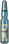 |
| `antibiotics` | 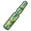 | 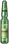 |
| `opium` |  | 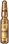 |
| `stabilozine` |  | 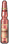 |
| `chloralhydrate` |  | 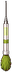 |
| `cyanide` |  | 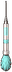 |
| `deliriumine` | 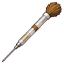 | 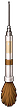 |
| `europabrew` |  | 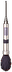 |
| `huskeggs` |  | 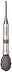 |
| `morbusine` | 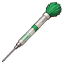 |  |
| `paralyzant` | 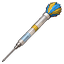 | 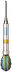 |
| `radiotoxin` |  | 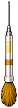 |
| `raptorbaneextract` | 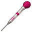 | 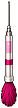 |
| `sufforin` | 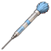 | 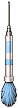 |
| `sulphuricacidsyringe` | 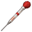 |  |
| `antidama1` |  |  |
| `antidama2` | 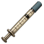 |  |
| `deusizine` |  |  |
| `liquidoxygenite` |  | 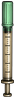 |
| `pomegrenadeextract` |  |  |
| `combatstimulantsyringe` |  | 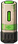 |
| `hyperzine` |  | 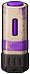 |
| `meth` |  | 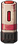 |
| `pressurestabilizer` |  | 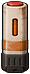 |
| `steroids` |  | 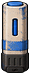 |
| `antinarc` |  | 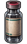 |
| `antiparalysis` | 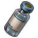 |  |
| `antipsychosis` |  | 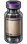 |
| `antirad` | 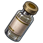 | 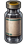 |
| `calyxanide` |  | 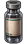 |
| `cyanideantidote` |  | 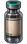 |
| `deliriumineantidote` |  | 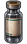 |
| `morbusineantidote` | 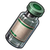 | 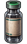 |
| `sufforinantidote` |  | 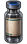 |
